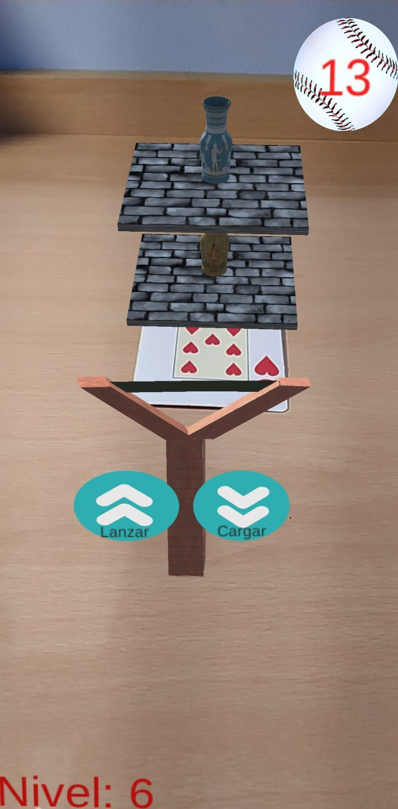

# CUIA-SLINGSHOTAR
Proyecto final de la asignatura Computación ubicua e inteligencia ambiental de la Universidad de Granada (UGR).

SlingShotAR es un apk móvil que simula el uso de un tirachinas. La aplicación se trata de un juego interactivo en el que la realidad aumentada juega un papel fundamental. El usuario tendrá que derribar objetos que aparecerán en distintas posiciones con diferente dificultad. El objetivo principal es ir subiendo de niveles sin que se agoten las bolas y por supuesto, entretenerse. 

  
  

